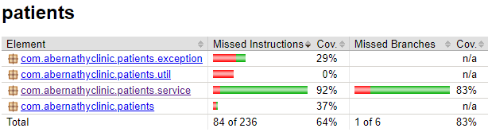
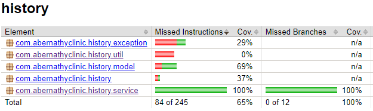
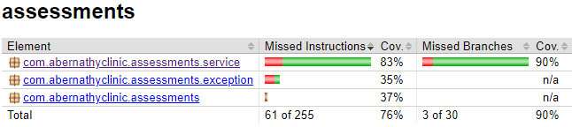

# Mediscreen

9th project from OpenClassrooms' Backend developer curriculum, a web application which helps to assess a patient's risk
of developing diabetes given their history.

## Summary

Mediscreen is based on 4 microservices. There is one for the web interface and the other ones are for the logic behind
the app.
Those microservices are:

- patients: manage your patients information
- history: add practitioner's notes about a patient
- assessments: assess the patient's risk of developing diabetes
- clientui: web interface

The final documentation can be found under [documentation](documentation/api-documentation.pdf).
Once the microservices are running the documentation can be view if you visit the
link http://localhost:0101/swagger-ui/index.html where `0101` is the port you chose for your microservice.

## Getting started

### What you need (technical stack)

- Java JDK 17.0.1
- SpringBoot 2.7.13
- Maven 3.8.4
- MongoDB
- MySQL
- Thymeleaf
- Bootstrap v.4.3.1
- Docker Desktop

### Running the application with Docker

Dockerfiles are available at the root folder of each microservice, thus you can either build the images (you must
run `mvn clean package` to generate the jar files prior to the build) or pull them
from the Docker Hub.

#### Get the application

Clone the repository at https://github.com/ernhollam/Mediscreen

`git clone https://github.com/ernhollam/Mediscreen`

#### Build jar files

Each microservice is stored in a separate folder. To build the jar files, for each folder, enter their root folder and
run the `mvn clean package` command

#### Running containers all at once thanks to Docker compose

Build and run all the microservices listed in the [compose file](docker-compose.yml).
`docker compose up -d`
The *-d* flag tells docker compose to run in detached mode.

In Docker Desktop, you should now have six containers running (ms-patients, ms-history, ms-assessments, ms-clientui,
mongodb and mysqldb).

To view the frontend, expand the app stack in Containers and select the link to `localhost:8080`⁠.
Add some patients and notes in the frontend. Notice that the risk assessment is available above patient's history of
notes.
You don't need to do the assessment, it is done dynamically everytime you refresh the page or add a new note.

## Test coverage

The coverage rate is about 91% for the application. Most of the tests are made on the service and controller layers.

### Patients

### History

### Assessments

